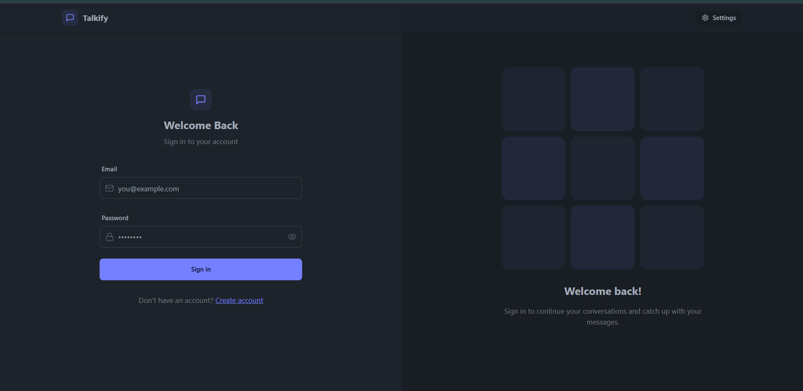

# 💬 Talkify - Connect to World



A real-time chat application built with **React** for the frontend and **Node.js** with **Socket.IO** for the backend. This app allows users to join rooms and chat with others in real-time.

## 🌟 Features

- 🗨️ Real-time messaging with Socket.IO  
- 🧑‍🤝‍🧑 Join specific chat rooms  
- 🔐 User authentication (if implemented)  
- 📱 Responsive design for mobile and desktop  

## 🛠 Tech Stack

- **Frontend:** React  
- **Backend:** Node.js, Express  
- **Real-time Communication:** Socket.IO  
- **Styling:** CSS / Tailwind CSS (based on your choice)  


## 📦 Installation

## Backend

### 1. Navigate to the `backend` directory:

   ```bash
   cd backend
```
### Install dependencies:

```
npm install
```
### Start the server:
```
node server.js
```
## Frontend
### Navigate to the frontend directory:

```
cd frontend
```
### Install dependencies:
```
npm install
```
### Start the development server:
```
npm start
```
### The app will be available at http://localhost:3000.

## 🤝 Contributing
Contributions are welcome! Please fork the repository and submit a pull request for any enhancements or bug fixes.

## 📄 License
This project is licensed under the MIT License.

Made with ❤️ by @mr-coder-raj
